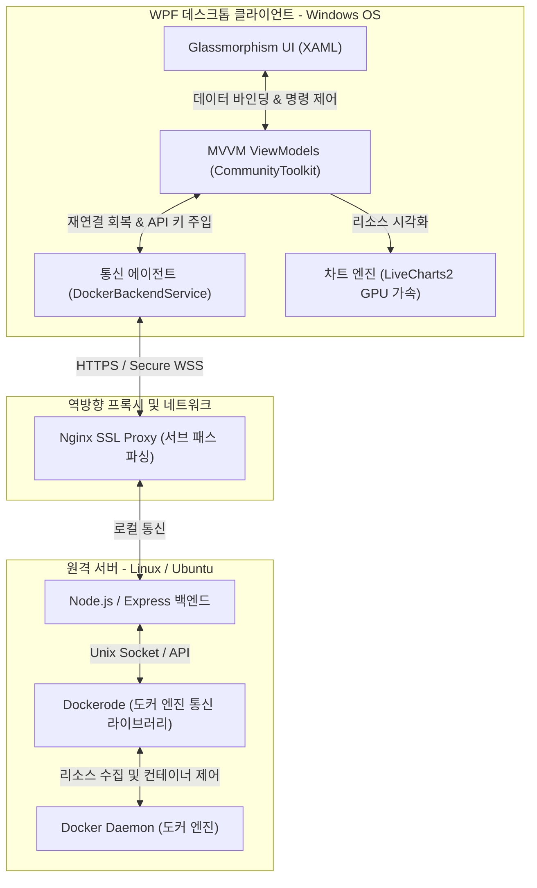

# 🐳 원격 도커 관리 및 실시간 관제를 위한 데스크톱 대시보드

---

## 📌 1. 프로젝트 개요 (Project Overview)

### 🔍 개발 배경 (Background)

- **기존 CLI 환경의 한계**: 원격 서버의 도커(Docker) 컨테이너 상태를 확인하거나 로그를 분석하려면 매번 SSH로 접속해 `docker ps`, `docker stats`, `docker logs` 등의 명령어를 반복 입력해야 하는 큰 번거로움이 있었습니다.
- **무거운 통합 모니터링 툴**: Prometheus, Grafana, Portainer 등 기존 솔루션들은 설치 및 설정이 복잡하고, 많은 메모리와 CPU 리소스를 소모하여 소형 서버나 개발 단계의 서버에 올리기엔 적합하지 않았습니다.
- **해결책**: 가벼우면서도 강력하고, 실시간 반응성이 매우 높은 데스크톱 클라이언트를 구축하여 원격 도커 컨테이너들을 마우스 클릭 한 번으로 모니터링하고 완벽하게 제어할 수 있는 전용 모니터링 대시보드를 개발했습니다.

### 💡 핵심 가치 (Core Values)

1. **실시간 양방향 통신 (Real-time Streaming)**: 소켓 통신을 이용해 지연 없이 CPU, 메모리 자원 변화 및 실시간 로그를 터미널처럼 스트리밍합니다.
2. **극상의 사용자 경험 (Premium UX)**: 눈이 편안한 **다크 모드 글라스모피즘(Glassmorphism)** UI를 제공하여 트렌디하고 아름다운 화면을 선사합니다.
3. **무결한 안정성 & 보안 (Stability & Security)**: 다중 소스 보안 API 인증과 소켓 끊김 자동 복구 엔진을 탑재하여 장시간 모니터링 시에도 다운되지 않습니다.

---

## 🏗️ 2. 시스템 아키텍처 및 기술 스택 (Architecture & Tech Stack)

원격 서버에 최소한의 리소스만 사용하는 가벼운 Node.js 에이전트를 두고, Windows 사용자 PC에서는 C# WPF 환경에서 비디오 카드를 활용해 UI를 실시간 가속 렌더링하는 효율적인 분산 아키텍처입니다.

### 🛠️ 기술 스택 (Tech Stack)

- **Client (Frontend)**: C# .NET 8.0, WPF, CommunityToolkit.Mvvm, LiveCharts2 (GPU 가속 선형 차트), SocketIOClient (.NET)
- **Server (Backend)**: Node.js, Express, Dockerode (Docker Engine API Wrapper), Socket.IO (양방향 스트리밍)
- **Infrastructure**: Nginx (Reverse Proxy & SSL), Docker, Docker-Compose

---

## 💎 3. 주요 핵심 기능 (Key Features)

이 제품은 복잡한 설치 없이 단 한 번의 연결로 도커 환경을 실시간으로 관제할 수 있는 5가지 코어 기능을 갖추고 있습니다.

### ① 📊 실시간 통합 대시보드 (Global System Dashboard)

- 실행 중인 모든 컨테이너의 실시간 상태(Running, Exited, Paused 등) 및 CPU 점유율, 메모리 사용량(Byte / MB 단위), 메모리 제한 한도 등을 실시간 카드로 요약 렌더링합니다.
- GPU 가속 기반의 렌더링 엔진을 탑재해 10개 이상의 대형 컨테이너가 동시에 동작해도 버벅임 없이 수치 변화가 매끄럽게 업데이트됩니다.

### ② 📈 개별 컨테이너 상세 관제 & GPU 가속 차트

- 개별 컨테이너를 클릭하면 전용 상세 페이지가 열리며, 지난 수 분간의 CPU 및 메모리 점유 변화 추이를 선형 그래프로 실시간 업데이트해 줍니다.
- 컨테이너의 실시간 메모리 사용량 프로그레스 바 및 텍스트 데이터를 세부적으로 시각화하여, 개별 자원 병목 상태를 즉각 파악할 수 있도록 돕습니다.

### ③ 📜 실시간 로그 터미널

- 개별/통합 컨테이너 터미널을 구현하여 도커에서 쏟아지는 로그를 고속 스트리밍합니다.
- **무한 스크롤 과거 로그 로딩**: 스크롤을 맨 위로 올리면 백엔드로부터 이전의 역사 로그를 실시간 프리펜딩(Prepending)합니다.

### ④ 📥 다기능 원격 로그 백업 유틸리티 (Advanced Log Export)

- 모니터링 중 장애가 발생했을 때 로그 파일 전체를 손쉽게 저장할 수 있습니다.
- 지난 24시간, 7일, 30일 및 사용자가 지정하는 날짜 범위 필터를 완벽 지원하며, 원격 서버에서 UNIX 타임스탬프로 초고속 변환하여 텍스트 형태(.log)로 로컬에 저장해 줍니다.

### ⑤ 🛡️ 소켓 자가 복구 (Auto-Reconnect) 및 다중 보안 인증

- **API Key 보안 통신**: 서버에 접속할 때 HTTP 헤더 및 웹소켓 핸드셰이크에 자동 암호화된 API Key 검증을 적용해 인가되지 않은 타인의 연결을 원천 차단합니다.
- **자가 복구**: Nginx 역방향 프록시의 타임아웃이나 물리적인 네트워크 미세 끊김이 발생하더라도, 클라이언트가 자동으로 재연결을 감지하고 기존 탭의 상태를 무설정/무클릭으로 자동 재구독(Re-subscribe)하여 관제 연속성을 유지합니다.

---

## 🛠️ 4. 기술적 고도화 및 핵심 트러블슈팅 (Engineering Highlights)

### [Challenge 1] 실시간 로그 폭탄으로 인한 스레드 병목 및 소켓 연결 해제 (`transport error`)

- **문제 상황**: 원격 도커 컨테이너에서 초당 수천 줄의 로그가 쏟아질 때, C# 클라이언트의 소켓 수신 스레드가 `App.Current.Dispatcher.Invoke`를 통해 동기식으로 UI를 업데이트하느라 대기 상태에 빠졌습니다. 이로 인해 소켓의 Keep-Alive 핑퐁 통신을 처리하지 못해 주기적으로 소켓이 끊어지며 `transport error` 재연결 루프에 빠지는 병목이 발생했습니다.
- **해결 방안 (Lock-Free 버퍼 배칭 구조 설계)**:
  - **수신부 비동기화**: 소켓 이벤트 리스너 내부에서 UI 동기화 코드를 완전히 걷어내고, 초경량 스레드 안전 큐인 `ConcurrentQueue<LogEntry>`를 도입하여 로그 수신 즉시 대기 없이 큐에 밀어 넣고 소켓 스레드를 즉시 해방시켰습니다.
  - **150ms 렌더링 타이머 구축**: UI 스레드에서는 `DispatcherTimer`를 가동하여 **150ms마다 한 번씩 큐에 적재된 로그들을 한꺼번에 벌크(Bulk) 처리**하여 WPF 컬렉션에 추가했습니다.
  - **결과**: 소켓 핑퐁 하트비트가 100% 보장되어 끊김 현상이 완전히 해결되었으며, 렌더링 연산 횟수가 획기적으로 감소하여 극한의 로그 유입 상황에서도 UI 프레임이 60fps로 매끄럽게 유지됩니다.

### [Challenge 2] 차트 시각화 성능 최적화 (SkiaSharp GPU 가속 엔진 도입)

- **문제 상황**: 다차원 실시간 선형 차트 렌더링 시 CPU 기반 소프트웨어 드로잉 방식은 무거운 벡터 연산으로 인해 CPU 점유율을 20~30%까지 점유하고 마우스 드래그 및 화면 전환 시 버벅임을 유발했습니다.
- **해결 방안 (OpenGL 하드웨어 가속)**:
  - **SkiaSharp 하드웨어 가속 바인딩**: 최신 렌더링 엔진인 **LiveCharts2**를 구성하고 렌더 파이프라인을 SkiaSharp의 GPU 가속 레이아웃과 연결했습니다.
  - **내장 그래픽 완벽 최적화**: 고가의 외장 그래픽뿐 아니라 노트북 등에 탑재된 일반 **내장 그래픽(Integrated GPU)**의 하드웨어 연산 장치(DirectX/OpenGL)를 직접 구동하도록 세팅했습니다.
  - **결과**: 실시간 그래프 렌더링 시 CPU 사용률을 거의 0%에 가깝게 낮추어 메인 연산 리소스를 클라이언트 비즈니스 로직에 온전히 할당할 수 있게 설계했습니다.

### [Challenge 3] Nginx 프록시 자가 로깅 무한 루프 회피 (Self-Logging Loop Avoidance)

- **문제 상황**: 웹소켓 통신 시 발생하는 모든 트래픽이 웹서버인 `nginx-proxy` 컨테이너의 표준 출력 로그를 발생시키고, 이 로그를 도커 엔진이 긁어와 다시 소켓을 통해 클라이언트에 전달하는 **통신 데이터 ➡️ 로그 생성 ➡️ 전송 ➡️ 로그 재생성**의 무한 루프가 발생하여 네트워킹 버퍼가 터지는 현상이 발견되었습니다.
- **해결 방안**: 서버 단 도커 스트림 수집 루프 내에 필터 처리를 심어 `docker-monitor` 자체 컨테이너 로그 및 무한 피드백을 발생시키는 프록시 컨테이너(`gyubuntu-nginx-proxy`) 로그를 사전에 제외하고 전송하도록 설계하여 패킷 낭비를 원천 방지했습니다.

